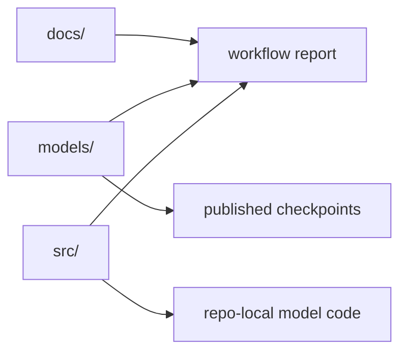

# ChromeCRISPR

[](https://doi.org/10.5281/zenodo.17058362)

ChromeCRISPR is a public artifact repository for the ChromeCRISPR study on CRISPR/Cas9 on-target activity prediction. It packages the published model checkpoints, hyperparameter records, architecture documentation, preprocessing notes, and a Snakemake workflow that verifies the public artifact set.

## What This Repository Supports

- access to the published ChromeCRISPR checkpoints
- clear documentation of preprocessing and training assumptions
- a real Snakemake workflow for public verification and organization
- repo-local Python examples for model construction and checkpoint loading
- an optional checkpoint compatibility smoke-test lane

## Repository Boundary

This repository does not currently provide a full raw-data retraining pipeline for the original manuscript experiments. The public workflow focuses on released artifacts, preprocessing clarity, and documentation consistency.

## Canonical Layout



- `models/`: canonical published checkpoints
- `src/models/`: Python model definitions only
- `docs/`: manuscript-facing documentation, hyperparameters, and training notes
- `workflow/`: Snakemake orchestration for verification/reporting
- `reports/workflow/`: generated workflow outputs

## Best Published Model

- `CNN_GRU+GC`
- Spearman correlation: `0.876`
- Mean squared error: `0.0093`
- Checkpoint: `models/chromecrispr_hybrid_models/CNN_GRU+GC.pth`
- Hyperparameters: `docs/hyperparameters/CNN_GRU+GC_hyperparameters.json`

## Preprocessing and Training Summary

The public workflow now generates a preprocessing manifest from the documented study setup.

Documented preprocessing path:
1. validate 21-mer sgRNA sequences
2. one-hot encode sequences to 84 sequence features
3. project to learned embeddings inside the neural models
4. compute GC content for GC-aware variants
5. optionally normalize numerical features
6. apply the documented 70/15/15 split with 5-fold cross-validation during model selection

To rebuild the structured preprocessing report:

```bash
bash scripts/run_snakemake.sh preprocessing
```

Generated artifact:
- `reports/workflow/preprocessing_manifest.md`

## Snakemake Workflow

```bash
bash scripts/run_snakemake.sh report
```

Useful targets:
- `inventory`: build the canonical model registry
- `integrity`: verify the public artifact set and code/artifact boundaries
- `audit`: check public markdown links and import examples
- `preprocessing`: build the structured preprocessing manifest
- `report`: build the full public summary and preprocessing report
- `smoke`: run the optional checkpoint compatibility smoke-test lane

Workflow docs: [workflow/README.md](workflow/README.md)

## Installation

```bash
git clone https://github.com/Daneshpajouh/ChromeCRISPR.git
cd ChromeCRISPR
pip install -r requirements.txt
```

For workflow usage, prefer the bootstrap wrapper:

```bash
bash scripts/run_snakemake.sh report
```

## Python Usage

### Create a model instance

```python
from src.models import create_cnn_gru_model, create_model

best_model = create_cnn_gru_model()
base_gru = create_model("gru")
```

### Load a published checkpoint

```python
import torch
from src.models import create_cnn_gru_model

model = create_cnn_gru_model()
state_dict = torch.load(
    "models/chromecrispr_hybrid_models/CNN_GRU+GC.pth",
    map_location="cpu",
)
model.load_state_dict(state_dict, strict=False)
model.eval()
```

### Repo-local evaluation utilities

```python
from src.evaluation import ChromeCRISPRMetrics

metrics = ChromeCRISPRMetrics()
```

## Documentation

- [docs/README.md](docs/README.md): documentation index
- [models/README.md](models/README.md): canonical checkpoint inventory
- [docs/training_procedures/README.md](docs/training_procedures/README.md): training and preprocessing notes
- [docs/hyperparameters/README.md](docs/hyperparameters/README.md): per-model hyperparameter records
- [workflow/README.md](workflow/README.md): workflow targets and outputs

## Citation

If you use ChromeCRISPR in research, please cite the associated study and Zenodo record referenced in this repository.
