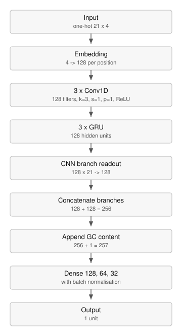

# Architectures

`src/models/architectures.py` defines every model. Each is summarised below; the module
docstring gives the full specification.

| model | convolutional | recurrent | dense | GC content |
|---|---|---|---|---|
| RF | Random Forest, 100 estimators |  |  |  |
| CNN | 2 × 128, k=3 |  | 64 |  |
| GRU |  | 2 × 128 | 64 |  |
| LSTM |  | 2 × 128 | 64 |  |
| BiLSTM |  | 2 × 128, bidirectional | 64 |  |
| deepCNN | 3 × 128, k=3 |  | 128, 64, 32 |  |
| deepGRU |  | 3 × 128 | 128, 64, 32 |  |
| deepLSTM |  | 3 × 128 | 128, 64, 32 |  |
| deepBiLSTM |  | 3 × 128, bidirectional | 128, 64, 32 |  |
| CNN_GRU+GC | 3 × 128, k=3 | 3 × 128 | 128, 64, 32 | yes |
| CNN_LSTM+GC | 3 × 128, k=3 | 3 × 128 | 128, 64, 32 | yes |
| CNN_BiLSTM+GC | 3 × 128, k=3 | 3 × 128, bidirectional | 128, 64, 32 | yes |
| Transformer |  | 3 layers, 128 units, 8 attention heads | 128, 64, 32 |  |

The GC variants of the base and deep models are the same networks with GC content appended
as a single input in the last layer.

## Encoding

One-hot, 21 × 4, embedded per position to 128 dimensions.

## Configurable settings

The convolutional branch reduces a 128 × 21 feature map to 128 dimensions. Three readouts
are selectable through `cnn_readout`: `flatten_proj` (the default, matching the base CNN,
whose convolutional output is flattened before the dense layers), `max` and `mean`. The
default costs 344,192 parameters; either pooling costs none.

Also configurable: the optimiser, learning rate, batch size, epoch count, loss function,
dropout rate, weight decay, learning-rate schedule, and whether batch normalisation is
applied to the convolutional layers.

## Diagrams

`docs/architectures/` holds one SVG per model, generated from the built modules by
`scripts/build_architecture_diagrams.py`.

## Checks

    pytest tests/test_architectures.py

Asserts each layer count, width, kernel size and fusion width.
