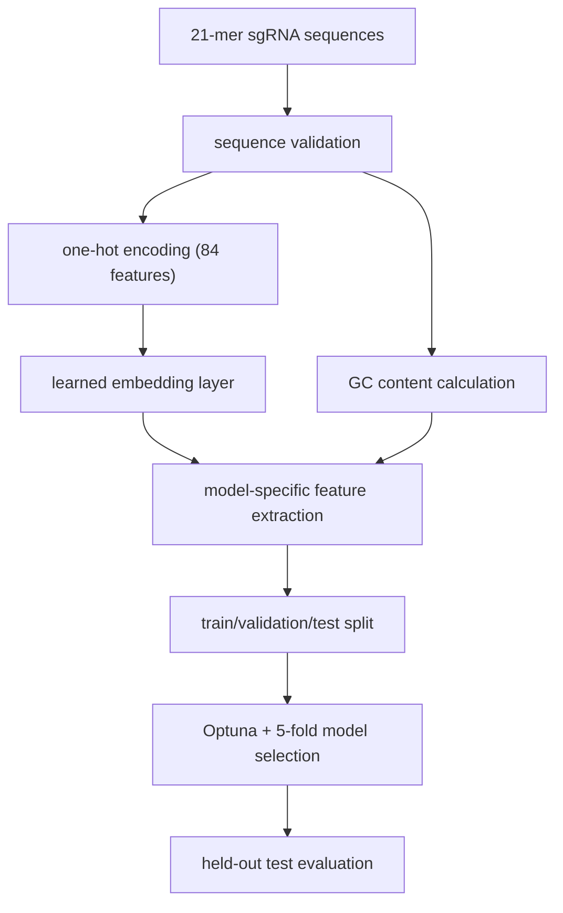

# ChromeCRISPR Training Procedures

This document outlines the documented training procedures used for the ChromeCRISPR study.

## Workflow View

## Data Preprocessing Pipeline

### 1. Sequence Validation
- **Input**: 21-mer sgRNA sequences (20 nucleotides + PAM)
- **Check**: Length and nucleotide composition
- **Output**: Validated sequence records

### 2. Sequence Encoding
- **Method**: One-hot encoding
- **Input**: 21-mer sgRNA sequences
- **Output**: 84-dimensional feature vector (21 × 4 nucleotides)

### 3. Sequence Embedding
- **Method**: Learned dense embedding inside the neural models
- **Input dimension**: 84 logical sequence features
- **Output dimension**: 128 latent dimensions

### 4. GC Content Calculation
- **Formula**: GC_content = (Count(G) + Count(C)) / sequence_length
- **Range**: 0-1
- **Integration**: Concatenated with final features before dense layers for GC-aware variants
- **Biological significance**: Correlates with sgRNA efficiency

### 5. Data Normalization
- **Method**: StandardScaler (optional where applicable)
- **Applied to**: Numerical features
- **Purpose**: Stabilize training

## Split and Validation Strategy

- **Train**: 70%
- **Validation**: 15%
- **Test**: 15%
- **Model selection**: 5-fold cross-validation
- **Optimization target**: Maximize Spearman correlation
- **Framework**: Optuna Bayesian optimization
- **Trials**: 100 per model

## Training Protocol

### Optimizer and Loss
- **Optimizer**: Adam
- **Loss**: Mean Squared Error
- **Weight decay**: model-specific within the documented search space
- **Betas**: (0.9, 0.999)

### Early Stopping and Scheduling
- **Monitor**: Validation Spearman correlation
- **Patience**: 10 epochs
- **Learning-rate schedule**: ReduceLROnPlateau
- **Scheduler patience**: 5 epochs

## Hardware Configuration

- **GPU**: NVIDIA V100 Volta
- **Memory**: 32GB HBM2
- **Platform**: Digital Research Alliance of Canada / Compute Canada environment

## Public Repo Boundary

This public repository documents the preprocessing and training procedure and exposes the resulting checkpoints. It does not bundle the full raw training dataset or promise a turnkey end-to-end retraining stack from scratch.
