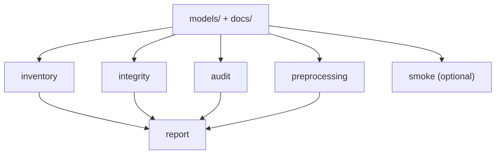

# ChromeCRISPR Snakemake Workflow

This workflow is the public reproducibility and organization layer for the ChromeCRISPR repository.

It is intentionally split into two lanes:
- default public verification: inventory, integrity, documentation audit, preprocessing manifest, and summary report
- optional smoke testing: checkpoint compatibility validation if the local Python environment has the required ML dependencies

## Workflow Graph



## Layout

```text
workflow/
├── Snakefile
├── config/chromecrispr.yaml
├── requirements-snakemake.txt
└── rules/
    ├── audit.smk
    ├── integrity.smk
    ├── preprocessing.smk
    ├── reporting.smk
    └── smoke.smk
```

## Targets

From the repository root:

```bash
bash scripts/run_snakemake.sh report
```

Available targets:
- `inventory`: build the canonical model registry
- `integrity`: verify checkpoints, workflow assets, and the no-duplicate policy under `src/models/`
- `audit`: verify public markdown links and repo-local import examples
- `preprocessing`: build a structured preprocessing and training manifest from the published docs
- `report`: build the full public summary plus preprocessing manifest
- `smoke`: run the optional checkpoint compatibility smoke-test lane

## Outputs

The workflow writes deterministic outputs to `reports/workflow/`:
- `model_registry.json`
- `model_registry.md`
- `repo_integrity.json`
- `repo_integrity.md`
- `public_examples_audit.json`
- `public_examples_audit.md`
- `preprocessing_manifest.json`
- `preprocessing_manifest.md`
- `public_repo_summary.md`
- `checkpoint_smoke.json`
- `checkpoint_smoke.md`

## Preprocessing Boundary

The workflow documents preprocessing clearly, but it does not pretend to reconstruct the entire raw-data manuscript pipeline from scratch. The public preprocessing manifest records the documented sequence encoding, GC-content handling, split strategy, and training protocol assumptions around the released artifacts.

## Optional Smoke Test

The `smoke` target is intentionally separate from the default `report` target. If `numpy`, `torch`, or `scipy` are missing from the current Python environment, the smoke target writes a clear skipped report instead of failing silently.
